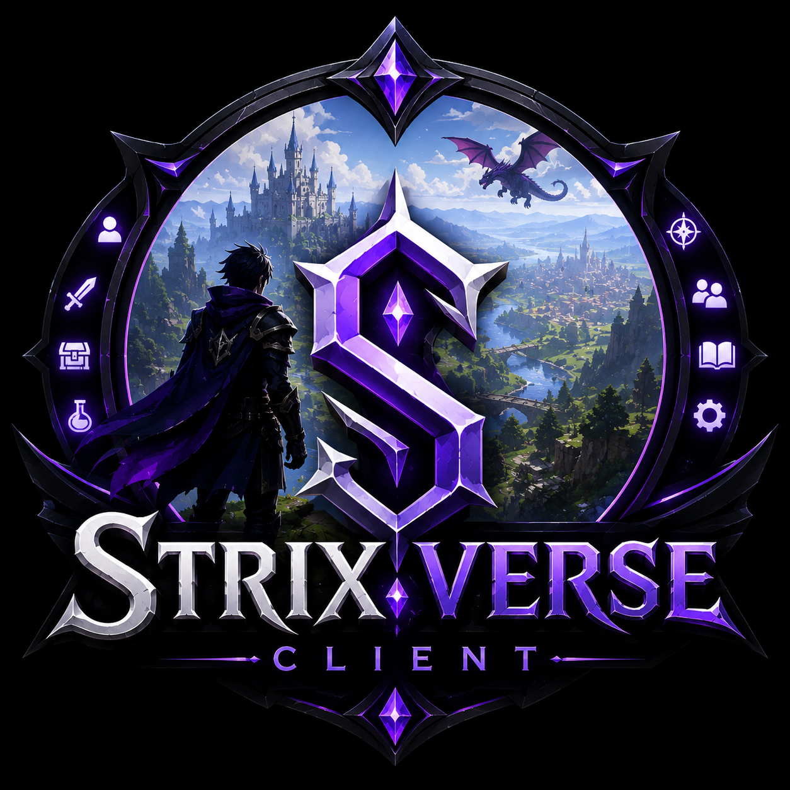

<p align="center">
  
</p>

<h1 align="center">StrixVerse Client</h1>

<p align="center">
  The official client application for the StrixVerse Sandbox MMORPG.
</p>

<p align="center">
  Multiplayer • Sandbox • RPG • Cross Platform • Modern C++
</p>

---

## Overview

StrixVerse Client is the official game client for the StrixVerse Sandbox MMORPG. It connects players to the StrixVerse server, providing an immersive multiplayer experience with exploration, combat, crafting, building, and social interaction in a persistent online world.

Designed with performance and modularity in mind, the client is built using modern C++ and is intended to work seamlessly with the StrixVerse Server.

## Features

- Modern rendering engine
- Cross-platform support
- Secure authentication
- Real-time multiplayer networking
- Character creation and customization
- Inventory management
- Equipment system
- Quest interface
- Crafting interface
- Skill progression
- Chat system
- Friends and party system
- Minimap and world map
- Audio system
- Settings menu
- Localization support

## Project Structure

```text
StrixVerse-Client/
├── assets/              # Textures, icons, audio, fonts
├── shaders/             # Graphics shaders
├── include/             # Header files
├── src/                 # Source code
├── resources/           # UI layouts and game resources
├── third_party/         # External libraries
├── docs/                # Documentation
├── tests/               # Unit tests
├── CMakeLists.txt
├── LICENSE
└── README.md
```

## Requirements

- C++20 compatible compiler
- CMake 3.20 or newer
- Vulkan or OpenGL compatible GPU
- Git

## Getting Started

### Clone the repository

```bash
git clone https://github.com/Yuzaki75/StrixVerse-Client.git
cd StrixVerse-Client
```

### Build

```bash
mkdir build
cd build

cmake ..
cmake --build . --config Release
```

## Planned Features

- Advanced graphics pipeline
- Dynamic lighting
- Character customization
- Mount system
- Trading interface
- Marketplace UI
- Guild management
- Voice chat
- Controller support
- Photo mode
- Replay system
- Accessibility options
- Mod support

## Screenshots

Screenshots and gameplay previews will be added as development progresses.

## Contributing

We welcome contributions from the community.

1. Fork the repository.
2. Create a feature branch.
3. Commit your changes.
4. Push your branch.
5. Open a Pull Request.

## Related Projects

- **StrixVerse Server** — Backend server framework powering the persistent MMORPG world.
- **StrixVerse Tools** — Development tools and utilities.
- **StrixVerse Launcher** — Official launcher for downloading updates and managing installations.

## License

This project is licensed under the MIT License.

## Authors

Developed by the StrixVerse Team.
````
